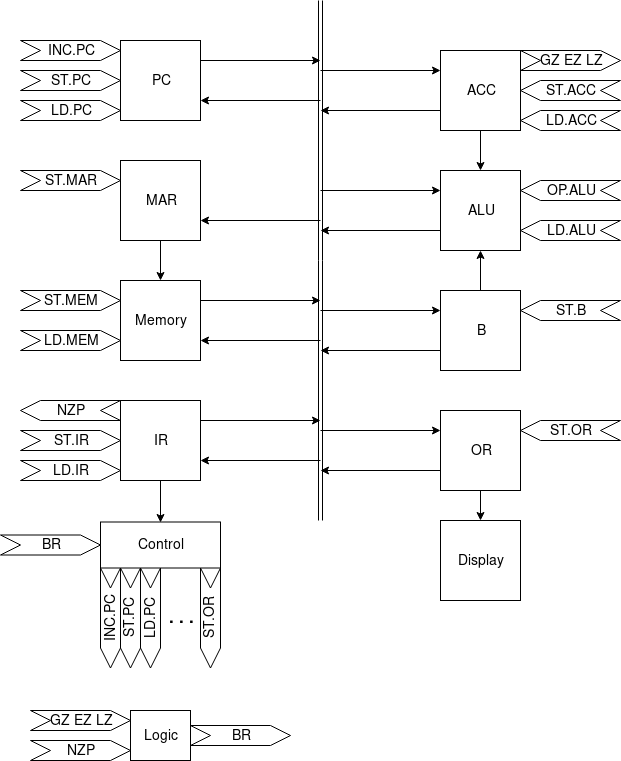
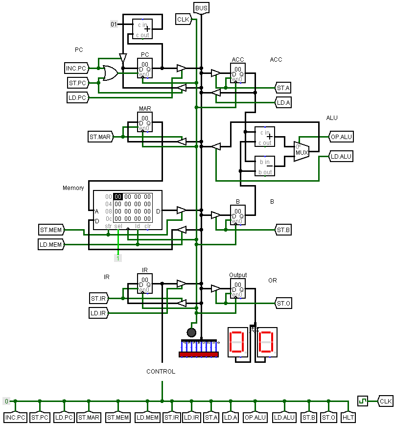

# 8-bit Computer

논설은 끝났는데 논설뽕이 차서 만드는 Toy Project

## Table of Contents

- [Architecture](#Architecture)
- [Schematic](#Schematic)
- [Instruction Set](#Instruction-Set)
- [Instruction Cycle](#Instruction-Cycle)

## Architecture



- Modules
  - BUS: Main data bus
  - PC: Program Counter Register
  - MAR: Memory Address Register
  - Memory: Programmable Memory
  - IR: Instruction Register
  - ACC: Register A (Accumulator)
  - B: Register B
  - OR: Output Register
  - Control: Control Module
- Control Flags
  - ST._Module_: Store data to _Module_ from BUS
  - LD._Module_: Load data from _Module_ to BUS
  - INC.PC: Increase PC by 1
  - OP.ALU: Operation of ALU
    - 0: Add
    - 1: Subtract
  - HLT: Halt the machine
  - CLK: Clock

## Schematic



Control Module is now WIP

## Instruction Set

- Opcode = Instruction[7:4]
- Imm = Instruction[3:0] (signed)
- Addr = Mem[PC + 1]

There is two type of instruction

- Single-byte Operation: Use only 1 byte of instruction. Only use _Opcode_ and _Imm_
- Two-byte Operation: Use 2 bytes of instruction, consider the second byte as _Addr_.

| Name | Type | Opcode | Description |  |
| -- | -- | -- | -- | -- |
| NOP | 1 byte | 0000 | No operation |  |
| ADD | 2 byte | 0001 | Add the value of memory at _Addr_ to _ACC_ | `ACC <- ACC + Mem[Addr]` |
| SUB | 2 byte | 0010 | Subtract the value of memory at _Addr_ from _ACC_ | `ACC <- ACC - Mem[Addr]` |
| AND | 2 byte | 0011 | Bitwise AND with _ACC_ and the value of memory at _Addr_ | `ACC <- ACC & Mem[Addr]` |
| NOT | 1 byte | 0100 | Bitwise NOT of _ACC_ | `ACC <- !ACC` |
| LDA | 2 byte | 0101 | Load _ACC_ from memory with _Addr_ | `ACC <- Mem[Addr + Imm]` |
| LDR | 1 byte | 0110 | Load _ACC_ from memory with Register(_ACC_)| `ACC <- Mem[ACC + Imm]` |
| STA | 2 byte | 0111 | Store _ACC_ to memory with _Addr_ | `Mem[Addr + Imm] <- ACC` |
| OUT | 1 byte | 1000 | Store the ACC's value to the output register | `OR <- ACC` |
| JMP | 2 byte | 1001 | Jump to _Addr_ | `PC <- Addr` |
| JMR | 1 byte | 1010 | Jump to the value of Register(_ACC_) | `PC <- ACC + Imm` |
| JMI | 1 byte | 1011 | Jump with _Imm_ | `PC <- PC + Imm` |
| BRA | 2 byte | 1100 | Branch to _Addr_. [Detail](#Branch-Detail) |  |
| LDP | 1 byte | 1101 | Load _ACC_ with the value of _PC_ | `ACC <- PC + Imm` |
| HLT | 1 byte | 1111 | Halt the machine |  |
|  |  | 1110 | Reserve, may used to System Call... |  |

### Branch Detail

1. Branch condition
    - N: Instruction[2]
    - Z: Instruction[1]
    - P: Instruction[0]
1. In branch instruction, branch is executed if:
    - _N_ is 1 and _ACC_ is less than zero
    - _Z_ is 1 and _ACC_ is equals to zero
    - _P_ is 1 and _ACC_ is greater than zero
1. So branch instruction is same as following pseudo code:

    ```pseudo
    if (N AND ACC < 0) OR (Z AND ACC = 0) OR (P AND ACC > 0) then
        PC <- Addr
    ```

1. For example, if _ACC_ is 00000101,
    - 1100 0100: No branch
    - 1100 0110: No branch
    - 1100 0001: Branch!
    - 1100 0101: Branch!
1. If N, Z, and P is all 1, BRA instruction is same as JMP instruction without _Imm_

## Instruction Cycle

1. Fetch
1. Decode
1. Execute
1. Memory
1. WriteBack
