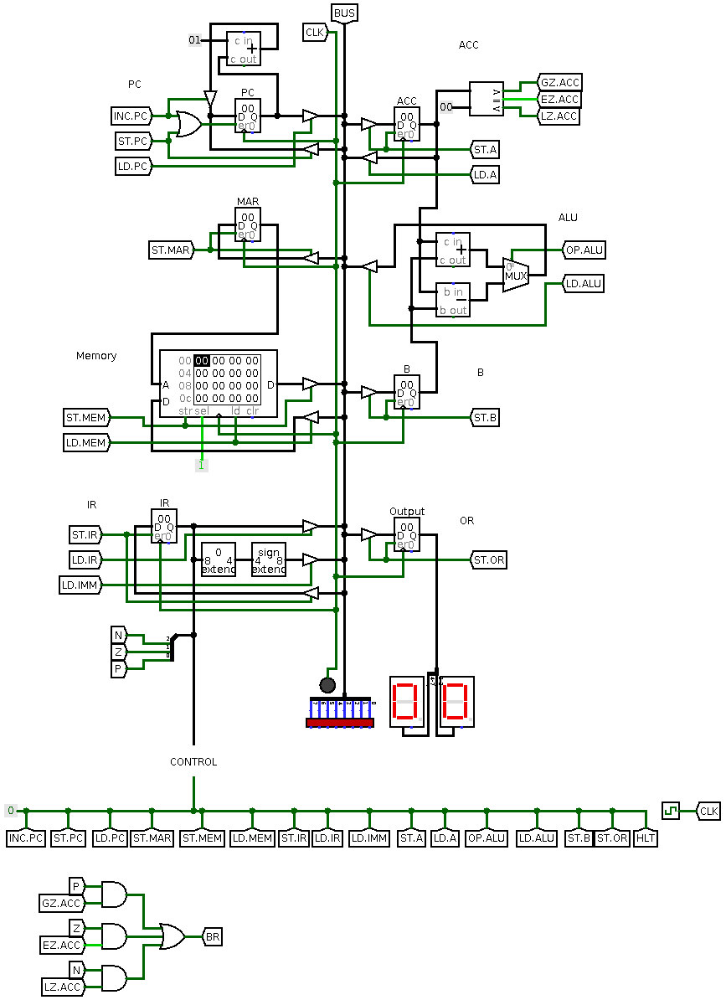

# 8-bit Computer

논설은 끝났는데 논설뽕이 차서 만드는 Toy Project

## Table of Contents

- [Architecture](#Architecture)
- [Schematic](#Schematic)
- [Instruction Set](#Instruction-Set)
- [Control Matrix](#Control-Matrix)

## Architecture

- Modules
  - BUS: Main data bus
  - PC: Program Counter Register
  - MAR: Memory Address Register
  - Memory: Programmable Memory
  - IR: Instruction Register
  - ACC: Register A (Accumulator)
  - B: Register B
  - OR: Output Register
  - Control: Control Module
- Control Flags
  - ST._Module_: Store data to _Module_ from BUS
  - LD._Module_: Load data from _Module_ to BUS
  - INC.PC: Increase PC by 1
  - OP.ALU: Operation of ALU
    - 0: Add
    - 1: Subtract
  - HLT: Halt the machine
  - CLK: Clock

## Schematic

Control Module is now WIP

## Instruction Set

WIP

## Control Matrix

WIP
