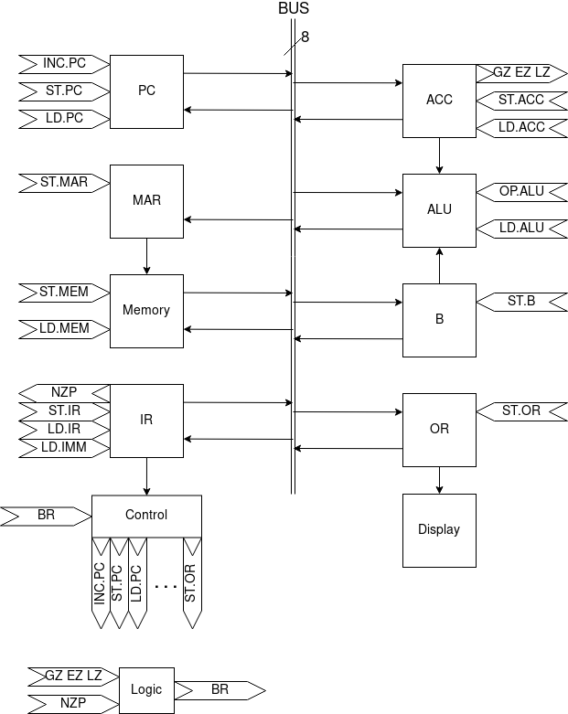

# 8-bit Computer

논설은 끝났는데 논설뽕이 차서 만드는 Toy Project

## Table of Contents

- [Architecture](#Architecture)
- [Schematic](#Schematic)
- [Instruction Set](#Instruction-Set)
- [Instruction Cycle](#Instruction-Cycle)

## Architecture



- Modules
  - BUS: Main data bus
  - PC: Program Counter Register
  - MAR: Memory Address Register
  - Memory: Programmable Memory
  - IR: Instruction Register
  - ACC: Register A (Accumulator)
  - B: Register B
  - OR: Output Register
  - Control: Control Module
- Control Flags
  - ST._Module_: Store data to _Module_ from BUS
  - LD._Module_: Load data from _Module_ to BUS
  - INC.PC: Increase PC by 1
  - OP.ALU: Operation of ALU
    - 0: Add
    - 1: Subtract
    - 2: AND
    - 3: NOT
  - HLT: Halt the machine
  - CLK: Clock

## Schematic


Control Module is now WIP

## Instruction Set

- Opcode = Instruction[7:4]
- Imm = Instruction[3:0] (signed)
- Addr = Mem[PC + 1]

There is two type of instruction

- Single-byte Operation: Use only 1 byte of instruction. Only use _Opcode_ and _Imm_
- Two-byte Operation: Use 2 bytes of instruction, consider the second byte as _Addr_.

| Name | Type | Opcode | Description |  |
| -- | -- | -- | -- | -- |
| NOP | 1 byte | 0000 | No operation |  |
| ADD | 2 byte | 0001 | Add the value of memory at _Addr_ to _ACC_ | `ACC <- ACC + Mem[Addr]` |
| SUB | 2 byte | 0010 | Subtract the value of memory at _Addr_ from _ACC_ | `ACC <- ACC - Mem[Addr]` |
| AND | 2 byte | 0011 | Bitwise AND with _ACC_ and the value of memory at _Addr_ | `ACC <- ACC & Mem[Addr]` |
| NOT | 1 byte | 0100 | Bitwise NOT of _ACC_ | `ACC <- !ACC` |
| LDA | 2 byte | 0101 | Load _ACC_ from memory with _Addr_ | `ACC <- Mem[Addr]` |
| LDR | 1 byte | 0110 | Load _ACC_ from memory with register _ACC_| `ACC <- Mem[ACC + Imm]` |
| LDP | 1 byte | 0111 | Load _ACC_ with the value of _PC_ | `ACC <- PC` |
| LDD | 2 byte | 1000 | Load _ACC_ with the value of _Addr_ directly | `ACC <- Addr` |
| STA | 2 byte | 1001 | Store _ACC_ to memory with _Addr_ | `Mem[Addr] <- ACC` |
| OUT | 1 byte | 1010 | Store the _ACC_'s value to the output register | `OR <- ACC` |
| JMP | 2 byte | 1011 | Jump to _Addr_ | `PC <- Addr + 1` |
| JMR | 1 byte | 1100 | Jump to the value of register _ACC_ | `PC <- ACC + Imm + 1` |
| BRA | 2 byte | 1101 | Branch to _Addr_. [Detail](#Branch-Detail) |  |
| BRR | 1 byte | 1110 | Branch to the value of register _ACC_. [Detail](#Branch-Detail) |  |
| HLT | 1 byte | 1111 | Halt the machine |  |

### Branch Detail

1. Branch condition
    - GZ.ACC: _ACC_ > 0
    - EZ.ACC: _ACC_ == 0
    - LZ.ACC: _ACC_ < 0
    - N: Instruction[2]
    - Z: Instruction[1]
    - P: Instruction[0]
    - BR: (_P_ AND _GZ.ACC_) OR (_Z_ AND _EZ.ACC_) OR (_N_ AND _LZ.ACC_)
1. In branch instruction, branch is executed if:
    - _N_ is 1 and _ACC_ is less than zero
    - _Z_ is 1 and _ACC_ is equals to zero
    - _P_ is 1 and _ACC_ is greater than zero
1. So branch instruction is same as following pseudo code:
    - BRA
      ```pseudo
      GZ.ACC = ACC > 0
      EZ.ACC = ACC == 0
      LZ.ACC = ACC < 0
      N = Instruction[2]
      Z = Instruction[1]
      P = Instruction[0]
      BR = (P AND GZ.ACC) OR (Z AND EZ.ACC) OR (N AND LZ.ACC)

      if BR is 1 then
          PC <- Addr + 1
      ```
    - BRR
      ```pseudo
      GZ.ACC = ACC > 0
      EZ.ACC = ACC == 0
      LZ.ACC = ACC < 0
      N = Instruction[2]
      Z = Instruction[1]
      P = Instruction[0]
      BR = (P AND GZ.ACC) OR (Z AND EZ.ACC) OR (N AND LZ.ACC)

      if BR is 1 then
          PC <- ACC + 1
      ```

1. For example, if _ACC_ is 00000101,
    - 1101 0100: No branch
    - 1110 0110: No branch
    - 1101 0001: Branch!
    - 1110 0101: Branch!
1. If N, Z, and P is all 1, BRA is same as JMP, BRR is same as JMR.

## Instruction Cycle

### In pseudo code

1. Fetch
    1. `MAR <- PC`
    1. `IR <- Mem[MAR]`
1. Execute
    - NOP
      1. X
    - ADD
      1. `PC <- PC + 1`
      1. `MAR <- PC`
      1. `B <- Mem[MAR]`
      1. `ACC <- ACC + B`
    - SUB
      1. `PC <- PC + 1`
      1. `MAR <- PC`
      1. `B <- Mem[MAR]`
      1. `ACC <- ACC - B`
    - AND
      1. `PC <- PC + 1`
      1. `MAR <- PC`
      1. `B <- Mem[MAR]`
      1. `ACC <- ACC & B`
    - NOT
      1. `ACC <- !ACC`
    - LDA
      1. `PC <- PC + 1`
      1. `MAR <- PC`
      1. `MAR <- Mem[MAR]`
      1. `ACC <- Mem[MAR]`
    - LDR
      1. `B <- SEXT(IR[3:0])`
      1. `MAR <- ACC + B`
      1. `ACC <- Mem[MAR]`
    - LDP
      1. `ACC <- PC`
    - LDD
      1. `PC <- PC + 1`
      1. `MAR <- PC`
      1. `ACC <- Mem[MAR]`
    - STA
      1. `PC <- PC + 1`
      1. `MAR <- PC`
      1. `Mem[MAR] <- ACC`
    - OUT
      1. `OR <- ACC`
    - JMP
      1. `PC <- PC + 1`
      1. `MAR <- PC`
      1. `PC <- Mem[MAR]`
    - JMR
      1. `B <- SEXT(IR[3:0])`
      1. `PC <- ACC + B`
    - BRA
      - if _BR_ is 1
          1. `PC <- PC + 1`
          1. `MAR <- PC`
          1. `PC <- Mem[MAR]`
    - BRR
      - if _BR_ is 1
          1. `PC <- ACC`
    - HLT
      1. `Halt`
1. `PC <- PC + 1`

### In Control Flags

1. Fetch
    1. ST.MAR LD.PC
    1. ST.IR LD.MEM
1. Execute
    - NOP
      1. X
    - ADD
      1. INC.PC
      1. ST.MAR LD.PC
      1. ST.B LD.MEM
      1. ST.ACC LD.ALU OP.ALU=0
    - SUB
      1. INC.PC
      1. ST.MAR LD.PC
      1. ST.B LD.MEM
      1. ST.ACC LD.ALU OP.ALU=1
    - AND
      1. INC.PC
      1. ST.MAR LD.PC
      1. ST.B LD.MEM
      1. ST.ACC LD.ALU OP.ALU=2
    - NOT
      1. ST.ACC LD.ALU OP.ALU=3
    - LDA
      1. INC.PC
      1. ST.MAR LD.PC
      1. ST.MAR LD.MEM
      1. ST.ACC LD.MEM
    - LDR
      1. ST.B LD.IMM
      1. ST.MAR LD.ALU OP.ALU=0
      1. ST.ACC LD.MEM
    - LDP
      1. ST.ACC LD.PC
    - LDD
      1. INC.PC
      1. ST.MAR LD.PC
      1. ST.ACC LD.MEM
    - STA
      1. INC.PC
      1. ST.MAR LD.PC
      1. ST.MEM LD.ACC
    - OUT
      1. ST.OR LD.ACC
    - JMP
      1. INC.PC
      1. ST.MAR LD.PC
      1. ST.PC LD.MEM
    - JMR
      1. ST.B LD.IMM
      1. ST.PC LD.ALU OP.ALU=1
    - BRA
      - if _BR_ is 1
          1. INC.PC
          1. ST.MAR LD.PC
          1. ST.PC LD.MEM
    - BRR
      - if _BR_ is 1
          1. ST.PC LD.ACC
    - HLT
      1. HLT
1. INC.PC
